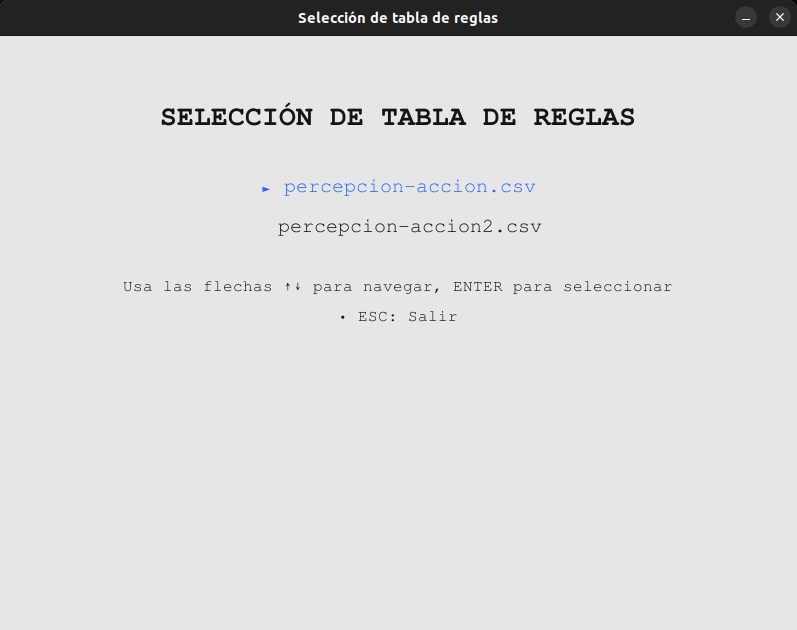
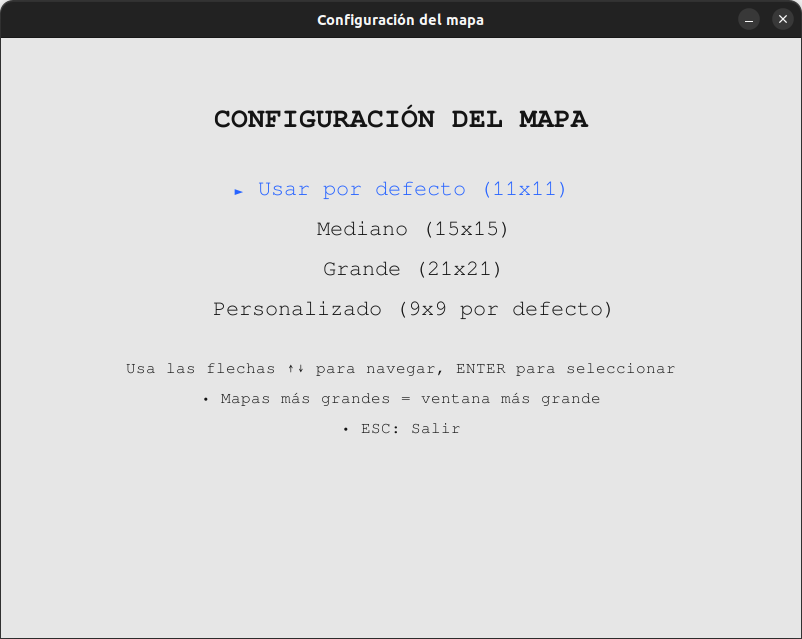
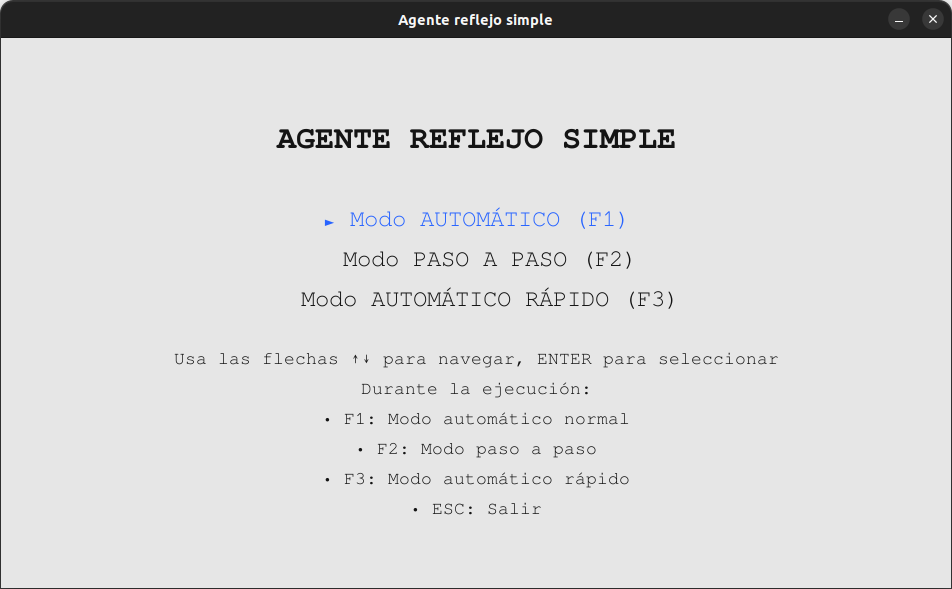
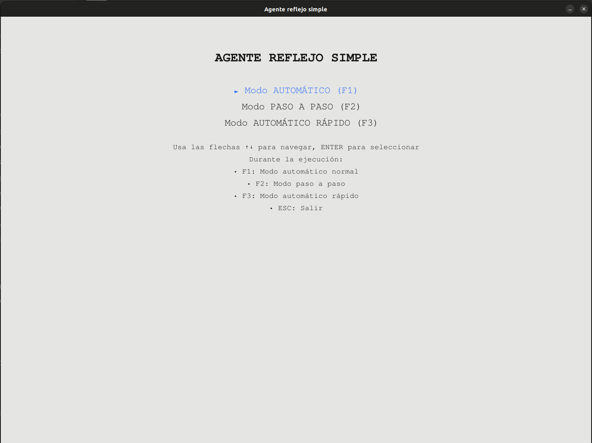
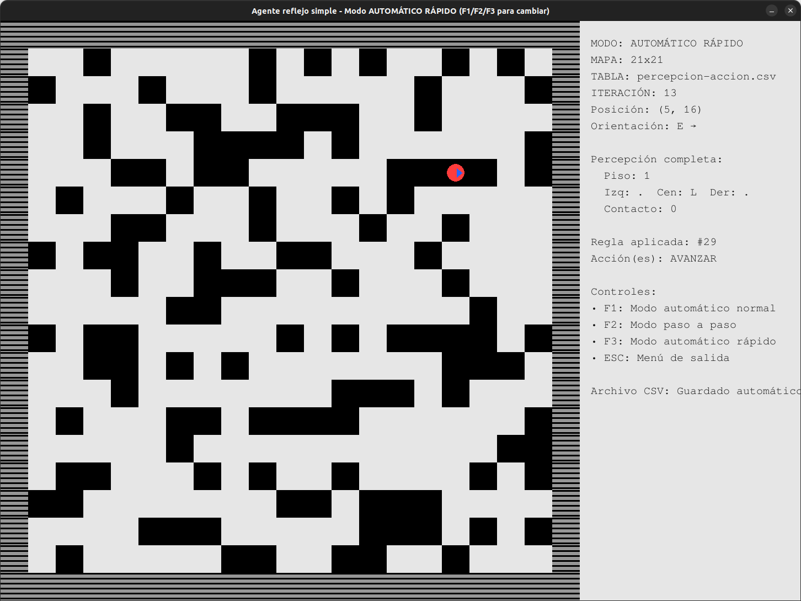

# Agente Reflejo Simple

Un simulador interactivo de un agente reflejo simple implementado en Python con Pygame. El agente utiliza una tabla de percepción-acción para navegar por un entorno bidimensional con obstáculos, generando reportes detallados de su comportamiento.

## 🎯 Características Principales

- **Simulación Visual**: Interfaz gráfica interactiva con Pygame
- **Navegación por Teclado**: Todos los menús con navegación consistente usando flechas ↑↓
- **Múltiples Modos**: Ejecución automática, paso a paso y modo rápido
- **Mapas Configurables**: Diferentes tamaños y densidades de obstáculos
- **Selección Automática de Tablas**: Detección automática de tablas CSV con menú gráfico
- **Tablas de Reglas**: Sistema de percepción-acción basado en CSV
- **Reportes Detallados**: Generación automática de archivos CSV con logs completos
- **Interfaz Unificada**: Todos los menús con indicadores visuales y navegación consistente
- **Flechas Direccionales**: Indicadores visuales de orientación del agente
- **Organización Mejorada**: Carpeta dedicada para tablas de reglas

## 📸 Capturas de Pantalla

### Menú de Selección de Tablas

*Interfaz unificada con navegación por teclado y indicadores visuales*

### Configuración del Mapa

*Menú de configuración con opciones por defecto seleccionadas*

### Simulación en Ejecución

*Agente en acción con panel de información detallado*

## Demo del Agente


### Panel de Información

*Vista detallada del panel lateral con flechas direccionales*

## 📋 Requisitos del Sistema

- **Python**: 3.6 o superior
- **Pygame**: Biblioteca para gráficos y eventos
- **Sistema Operativo**: Windows, macOS o Linux

### Instalación de Dependencias

```bash
pip install pygame
```

## 📁 Estructura del Proyecto

```
agente-reflejo-simple/
├── agente.py                 # Programa principal del simulador
├── README.md                 # Este archivo
├── tablas/                   # Carpeta con tablas de reglas
│   ├── percepcion-accion.csv     # Tabla de reglas original
│   └── percepcion-accion2.csv    # Tabla de reglas alternativa
└── salida/                   # Carpeta de archivos CSV generados
    └── salida-YYYYMMDD-HHMMSS.csv
```

## 🚀 Cómo Ejecutar

1. **Clona o descarga el proyecto**
2. **Navega al directorio del proyecto**
3. **Ejecuta el simulador**:

```bash
python agente.py
```

## 🎮 Interfaz y Controles

### Configuración Inicial
Al iniciar el programa, se presentan tres menús de configuración con navegación unificada:

#### 1. Selección de Tabla de Reglas
El programa detecta automáticamente todas las tablas CSV en la carpeta `tablas/`:

- **► Tabla Original**: Comportamiento básico (seleccionada por defecto)
- **Tabla Alternativa**: Comportamiento diferente
- **Tablas Personalizadas**: Cualquier archivo CSV que agregues

#### 2. Configuración del Mapa
Después de seleccionar la tabla, configura el tamaño del mapa:

1. **► Usar por defecto (11x11)** ← Seleccionado por defecto
2. **Mediano (15x15)**
3. **Grande (21x21)**
4. **Personalizado (9x9 por defecto)**

#### 3. Selección de Modo
Después de configurar el mapa, elige el modo de ejecución:

- **► Modo AUTOMÁTICO** ← Seleccionado por defecto
- **Modo PASO A PASO**
- **Modo AUTOMÁTICO RÁPIDO**

### Navegación Unificada
**Todos los menús** usan la misma interfaz:
- **Flechas ↑↓**: Navegar entre opciones
- **ENTER**: Seleccionar opción actual
- **ESC**: Salir/cancelar
- **Indicador visual**: Flecha azul "►" muestra la opción seleccionada

### Controles Durante la Ejecución

| Tecla | Acción |
|-------|--------|
| `F1` | Cambiar a modo automático normal |
| `F2` | Cambiar a modo paso a paso |
| `F3` | Cambiar a modo automático rápido |
| `ENTER` | Avanzar un paso (solo en modo paso a paso) |
| `ESC` | Mostrar menú de salida |

### Menú de Salida (ESC)
Al presionar ESC durante la ejecución, aparece un menú con navegación unificada:

- **► Reiniciar recorrido del agente** ← Seleccionado por defecto
- **Volver al menú inicial**
- **Volver al menú de modo**
- **Salir completamente**

**Navegación**: Flechas ↑↓ + ENTER, o ESC para cancelar

## ⚙️ Configuración Avanzada

### Gestión de Tablas de Reglas

#### Selección Automática
El programa detecta automáticamente todas las tablas CSV en la carpeta `tablas/` y te permite seleccionarlas desde un menú gráfico.

#### Agregar Nuevas Tablas
1. **Crea tu archivo CSV** siguiendo el formato estándar
2. **Colócalo en la carpeta `tablas/`**
3. **Ejecuta el programa** - aparecerá automáticamente en el menú

#### Formato de Tabla Personalizada
```csv
# piso (0=blanco 1=línea), izq (P=pared|L=línea|.=blanco), cen, der, contacto (0=no|1=sí), accion1,accion2
0,P,.,.,0,AVANZAR
1,L,L,L,0,AVANZAR,ROTAR+90
```

### Tablas de Reglas Disponibles

#### 1. `percepcion-accion.csv` - Tabla Original
- **Comportamiento**: Básico, reactivo
- **Ventajas**: Simplicidad, fácil de entender
- **Desventajas**: Puede generar bucles infinitos
- **Uso recomendado**: Para aprendizaje y análisis básico

#### 2. `percepcion-accion2.csv` - Tabla Alternativa
- **Comportamiento**: Estrategia diferente de navegación
- **Características**: Patrones de movimiento alternativos
- **Uso recomendado**: Para comparar diferentes enfoques de comportamiento

### Densidad de Obstáculos

Modifica la variable `DENSITY` en `agente.py`:

```python
# Línea 25 del archivo agente.py
DENSITY = 0.3  # 30% de probabilidad de obstáculo por celda
```

**Valores recomendados:**
- `0.0` - Sin obstáculos (solo paredes perimetrales)
- `0.2` - Pocos obstáculos (mapa muy explorable)
- `0.3` - Densidad equilibrada (recomendado)
- `0.5` - Muchos obstáculos (mapa complejo)
- `1.0` - Máxima densidad (mapa muy difícil)

## 🔬 Funcionamiento Técnico

### Arquitectura del Agente

El agente implementa un **sistema reflejo simple** basado en reglas condición-acción:

1. **Percepción**: El agente percibe su entorno inmediato
2. **Decisión**: Busca una regla que coincida con la percepción
3. **Acción**: Ejecuta las acciones asociadas a la regla
4. **Repetición**: El ciclo se repite indefinidamente

### Sistema de Percepción

El agente percibe **5 elementos** de su entorno:

| Elemento | Descripción | Valores Posibles |
|----------|-------------|------------------|
| **Piso** | Estado de la celda actual | `0` (blanco), `1` (línea negra) |
| **Izquierda** | Celda a la izquierda | `P` (pared), `L` (línea), `.` (blanco) |
| **Centro** | Celda al frente | `P` (pared), `L` (línea), `.` (blanco) |
| **Derecha** | Celda a la derecha | `P` (pared), `L` (línea), `.` (blanco) |
| **Contacto** | Si chocó en el último movimiento | `0` (no), `1` (sí) |

### Sistema de Acciones

El agente puede ejecutar **3 tipos de acciones**:

- **`AVANZAR`**: Mover una celda hacia adelante
- **`ROTAR+90`**: Girar 90° en sentido horario
- **`ROTAR-90`**: Girar 90° en sentido antihorario

### Formato de las Tablas CSV

Cada línea de la tabla CSV sigue el formato:
```
piso,izq,cen,der,contacto,accion1,accion2
```

**Ejemplo:**
```csv
0,P,.,.,0,AVANZAR
1,L,L,L,0,AVANZAR,ROTAR+90
```

### Representación Visual

- **🔴 Círculo rojo**: Posición del agente
- **🔵 Flecha azul**: Orientación del agente (N/E/S/W)
- **⚫ Cuadros negros**: Obstáculos/líneas
- **⚪ Cuadros blancos**: Espacios libres
- **🔲 Cuadros grises**: Paredes perimetrales

### Panel de Información Mejorado

El panel lateral muestra información detallada con mejoras visuales:

- **Flechas direccionales**: La orientación incluye flechas (N ↑, E →, S ↓, W ←)
- **Información en tiempo real**: Posición, percepción, reglas aplicadas
- **Controles dinámicos**: Instrucciones actualizadas según el modo
- **Tabla activa**: Muestra qué tabla de reglas se está usando

## 📊 Archivos de Salida

El programa genera automáticamente archivos CSV en la carpeta `salida/` con timestamp único:

### Formato del Archivo CSV

```csv
#,Pos,Orientación,Piso,Izquierda,Centro,Derecha,Contacto,Regla,Acción,Nueva Pos,Nueva Orientación
1,[5,7],^,0,P,.,.,0,#20,AVANZAR,[4,7],^
2,[4,7],^,0,P,L,.,0,#21,AVANZAR y ROTAR+90,[4,6],>
```

### Campos del CSV

| Campo | Descripción | Ejemplo |
|-------|-------------|---------|
| **#** | Número de iteración | `1`, `2`, `3`... |
| **Pos** | Posición inicial | `[5,7]` |
| **Orientación** | Orientación inicial | `^` (Norte), `>` (Este), `v` (Sur), `<` (Oeste) |
| **Piso** | Estado de la celda actual | `0` (blanco), `1` (línea) |
| **Izquierda/Centro/Derecha** | Percepción lateral | `P` (pared), `L` (línea), `.` (blanco) |
| **Contacto** | Si chocó | `0` (no), `1` (sí) |
| **Regla** | Número de regla aplicada | `#20`, `#21` |
| **Acción** | Acciones ejecutadas | `AVANZAR`, `AVANZAR y ROTAR+90` |
| **Nueva Pos** | Posición final | `[4,6]` |
| **Nueva Orientación** | Orientación final | `>` |

## 📝 Ejemplos de Uso

### Ejemplo 1: Análisis Básico (Configuración por Defecto)
```bash
# Ejecutar con configuración por defecto
python agente.py
# Solo presionar ENTER tres veces:
# 1. ENTER → Selecciona primera tabla
# 2. ENTER → Selecciona mapa 11x11
# 3. ENTER → Selecciona modo automático
# Observar comportamiento y revisar salida/salida-YYYYMMDD-HHMMSS.csv
```

### Ejemplo 2: Comparación de Tablas
```bash
# Ejecutar el programa dos veces y seleccionar diferentes tablas:
python agente.py
# Primera ejecución: Seleccionar tabla original
# Segunda ejecución: Seleccionar tabla alternativa
# Comparar los archivos CSV generados
```

### Ejemplo 3: Análisis Paso a Paso
```bash
python agente.py
# Navegar con flechas ↓ para seleccionar:
# 1. ENTER → Primera tabla
# 2. ↓ + ENTER → Personalizado (9x9)
# 3. ↓ + ENTER → Modo paso a paso
# Usar ENTER durante ejecución para avanzar paso a paso
```

### Ejemplo 4: Mapas Complejos
```bash
# Editar agente.py línea 25: DENSITY = 0.5
python agente.py
# Seleccionar: 1 (Tabla Original), 3 (21x21), 1 (Automático)
```

## ⚠️ Limitaciones Conocidas

### Limitaciones del Agente Reflejo Simple

- **🔄 Bucles Infinitos**: Sin memoria, puede repetir patrones indefinidamente
- **🗺️ Cobertura Incompleta**: No garantiza exploración del 100% del mapa
- **🧠 Sin Memoria**: No recuerda posiciones visitadas anteriormente
- **🎯 Sin Objetivo**: No tiene metas específicas, solo reacciona al entorno

### Limitaciones Técnicas

- **📏 Tamaño de Ventana**: Mapas muy grandes pueden exceder la resolución de pantalla
- **⚡ Rendimiento**: Modo muy rápido puede ser difícil de seguir visualmente
- **💾 Archivos CSV**: Se acumulan en la carpeta `salida/` (limpiar periódicamente)

## 💡 Recomendaciones de Uso

### Para Aprendizaje
1. **Comienza con `percepcion-accion.csv`** - Comportamiento básico
2. **Usa densidad baja (0.2-0.3)** - Mapas más explorables
3. **Modo paso a paso** - Para entender cada decisión
4. **Mapas pequeños (9x9)** - Más fácil de analizar

### Para Investigación
1. **Múltiples ejecuciones** - Analizar patrones de comportamiento
2. **Diferentes densidades** - Estudiar impacto de la complejidad
3. **Comparar tablas** - Evaluar efectividad de las reglas
4. **Revisar CSV** - Análisis cuantitativo del comportamiento

### Para Demostraciones
1. **Modo automático rápido** - Para audiencias
2. **Mapas medianos (15x15)** - Balance entre complejidad y claridad
3. **Densidad equilibrada (0.3)** - Comportamiento interesante sin ser caótico

## 🔧 Personalización Avanzada

### Crear Tu Propia Tabla de Reglas

1. **Copia una tabla existente**:
   ```bash
   cp tablas/percepcion-accion.csv tablas/mi-tabla.csv
   ```

2. **Edita las reglas** siguiendo el formato:
   ```csv
   piso,izq,cen,der,contacto,accion1,accion2
   ```

3. **Ejecuta el programa** - tu tabla aparecerá automáticamente en el menú de selección

### Modificar Parámetros del Sistema

```python
# En agente.py
ROWS, COLS = 15, 15        # Tamaño por defecto
CELL_SIZE = 50             # Tamaño de celda en píxeles
FPS = 60                   # Frames por segundo
STEP_DELAY = 0.1           # Delay entre pasos (modo paso a paso)
DENSITY = 0.3              # Densidad de obstáculos
```

---

## 📝 Nota de Desarrollo

Este proyecto fue desarrollado con el apoyo de **Inteligencia Artificial** mediante prompts, combinando conocimientos previos sobre **agentes inteligentes** y documentación académica en el área. El simulador está actualmente en **fase de mejora continua**, incorporando nuevas funcionalidades y optimizaciones basadas en feedback y análisis de comportamiento.

### Metodología de Desarrollo:
- 🤖 **Asistencia de IA**: Desarrollo guiado por prompts especializados
- 📚 **Base Teórica**: Aplicación de conceptos de agentes inteligentes
- 🔄 **Iterativo**: Mejoras continuas basadas en pruebas y análisis
- 📖 **Documentado**: Referencias académicas y estudios previos

---

**Desarrollado usando Python y Pygame**
